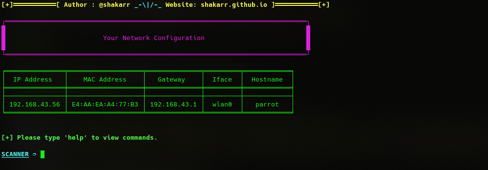

# Scanner

Scanner is a tool for automated scans with nmap, from a simple scan to more complex scans

<p align="center">

</p>

# Dependencies

- nmap
- tabulate
- terminaltables

# Installation

```
git clone https://github.com/shakarr/scanner.git
cd scanner
```
For pip3 run:
```
pip3 install -r requirements.txt
```
For pip run:
```
pip install -r requirements.txt
```

# Tested on

<table>
    <tr>
        <th>Operative system</th>
        <th> Version </th>
    </tr>
    <tr>
        <td>Ubuntu</td>
        <td> 20.04.2.0 LTS / 21.04 </td>
    </tr>
    <tr>
        <td>Kali linux</td>
        <td> Rolling / Sana</td>
    </tr>
    <tr>
        <td>Parrot OS</td>
        <td>4.11.2 </td>
    </tr>
</table>

# Features

- Port scanning
- Network mapping